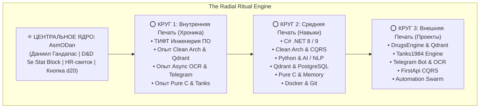

# План реализации: "AsmODan — The Radial Ritual Circle & 3 Arcane Seals"

## Описание концепции

Превращение сайта в **интерактивную оккультно-технологическую ритуальную систему (Radial Arcane Engine)**:
В центре экрана — **Ядро Персонажа (The Core / Inner Sanctum)**, окруженное **3 вращающимися концентрическими кругами-печатями**:
1. **⭕ Круг 1 (Внутренняя Печать)**: Образование (ТИФТ) и Опыт работы (Таймлайн).
2. **⭕ Круг 2 (Средняя Печать)**: Навыки, Матрица технологий и Школы заклинаний.
3. **⭕ Круг 3 (Внешняя Печать)**: Проекты-Реликвии (`DrugsEngine`, `Tanks1984`, `Telegram OCR`, `FirstApi`).

---

## 🏛️ Архитектура интерфейса и взаимодействие

### 1. Центральное Ядро (The Core / Inner Sanctum)
- **Визуальное оформление**: Светящийся оккультный кристалл / рунический диск в центре ритуала.
- **Содержимое**:
  - Аватар Даниила с вращающимся защитным нимбом и живым статусом доступности.
  - Имя: **Даниил Гандапас** (`AsmODan`), титул: *Level 20 Systems Archmage*.
  - **Интерактивный D&D 5e Stat Block**: 6 атрибутов (`STR 18`, `DEX 18`, `CON 20`, `INT 20`, `WIS 19`, `CHA 17`) с бонусами и описаниями при наведении.
  - **Быстрый HR-селектор**: Сургучная печать для скачивания `resume.pdf` в 1 клик, локация (Тирасполь/Remote), контакты.
  - **Кнопка броска D&D d20**: интерактивный бросок кубика прямо в ядре.

---

### 2. Три Концентрических Круга-Печати (The 3 Concentric Seals)

#### ⭕ Круг 1: Печать Хроники (Образование и Опыт)
- Ближайшая к ядру орбита.
- **Интерактивные руны-узлы**:
  - 🏛️ *Академия*: **ТИФТ** — Физико-технический факультет (Инженерия ПО, алгоритмы, системное программирование).
  - 🔮 *2024 — Наст. время*: **DrugsEngine & Qdrant** (Clean Architecture, CQRS, микросервисы).
  - 👁️ *2023 — 2024*: **Telegram Bot Suite & OCR** (Tesseract OCR, асинхронные пайплайны).
  - 🛡️ *2022 — 2023*: **Tanks1984** (Pure ANSI C, ручное управление памятью).
- **Механика**: При клике на узел открывается всплывающий манускрипт с подробным описанием этапа, обязанностями и технологиями.

#### ⭕ Круг 2: Печать Гримуара (Навыки & Компетенции)
- Средняя орбита с рунами технологий.
- **Интерактивные руны-узлы**:
  - ⚡ `C# .NET 8/9` (Async/Await, LINQ, Memory&lt;T&gt;, Generic Host)
  - 🏛️ `Clean Architecture & CQRS` (Domain isolation, MediatR, DDD)
  - 🐍 `Python & AI / NLP` (FastAPI, AsyncIO, PyTorch, Embeddings)
  - 🌌 `Qdrant & Vector DB` (1536-dim Cosine search, Payload filtering)
  - 🗄️ `PostgreSQL & EF / Dapper` (Dual-ORM подход, индексы, транзакции)
  - ⚙️ `Pure ANSI C` (Pointers, malloc/free, детерминированные циклы)
- **Механика**: При наведении/клике прорисовывается энергетическая дуга к ядру и выводится карточка уровня владения и применимости на практике.

#### ⭕ Круг 3: Печать Реликвий (Проекты)
- Внешняя величественная орбита с самыми крупными узлами-артефактами.
- **Интерактивные руны-узлы**:
  - 🗡️ **DrugsEngine** (Clean Architecture + CQRS + Qdrant Vector Search)
  - 🛡️ **Tanks1984** (Игровой движок на чистом Си)
  - 👁️ **Telegram OCR** (Tesseract OCR + Async Worker Pool)
  - 📜 **FirstApi** (REST API + EF Core + Dapper)
  - 🐝 **Automation Swarm** (Python AsyncIO воркеры)
- **Механика**: Клик по проекту плавно сдвигает ритуальный круг и разворачивает справа **HUD Инспектора Системы** (Case Study, концентрические слои Domain/App/Infra, метрики и прямой переход на GitHub).

---

### 3. Интерактивная модальность и HUD
- **Режим "Строгий список для HR" (HR Fast-Track View)**: В правом верхнем углу кнопка быстрого переключения в плоский печатный свиток, где все 3 круга развернуты в классическое резюме.
- **The Altar of AsmODan (Quake CLI)**: Сверху выпадает терминал по клавише **`` ` ``** (тильда) со всеми командами (`roll d20`, `cast <spell>`, `whoami`, `tanks`, `ls`).
- **Звуковой синтезатор (Web Audio API)**: Эффекты вращения орбит, звон рун при клике и кубик d20 с переключателем звука `[🔊 FX]`.
- **Мобильная адаптивность**: На экранах смартфонов круги трансформируются в интерактивный радиально-ярусный список с сохранением визуальной иерархии и свечения печатей.

---

## 🛠️ План реализации (Proposed Changes)

### 1. Данные (`projects-data.js`)
- Добавить геометрические координаты и параметры орбит (радиусы, углы, иконки, цвета свечения) для всех 3 кругов.

### 2. Разметка (`index.html`)
- Создать контейнер `#radial-sanctum-stage` с SVG-ритуальными концентрическими орбитами и HTML-узлами.
- Разместить центральное ядро `#ritual-core` с D&D стат-блоком и портретом.
- Разместить 3 яруса орбит (`.seal-ring-1`, `.seal-ring-2`, `.seal-ring-3`).
- Создать выдвижной боковой инспектор `#ritual-side-inspector` для детального разбора проектов и опыта.

### 3. Стилизация (`styles.css`)
- Реализовать вращение концентрических кругов на CSS (`@keyframes orbitalRotate`).
- Оформить свечение печатей (Aether Cyan `#00f0ff`, Blood Crimson `#f43f5e`, Hellfire Gold `#fbbf24`).
- Реализовать плавный сдвиг ядра при открытии инспектора и адаптивность под экраны до 320px.

### 4. Интерактивная логика (`main.js`)
- Математика позиционирования узлов на кругах (тригонометрия `sin/cos` или CSS transform-origin).
- Логика замедления/остановки вращения при hover.
- Открытие карточек инспектора при клике на узлы Круга 1 (Хроника), Круга 2 (Навыки) и Круга 3 (Проекты).
- Связка с D&D дайс-роллером и Altar CLI.

---

## 🧪 План верификации

1. **Проверка синтаксиса**: `node -c main.js projects-data.js`.
2. **Интерактивное тестирование**:
   - Клик по Ядру ➔ отображение D&D статов и бросок d20.
   - Клик по Кругу 1 (Хроника) ➔ отображение ТИФТ и этапов опыта.
   - Клик по Кругу 2 (Навыки) ➔ подсветка категорий и связей.
   - Клик по Кругу 3 (Проекты) ➔ раскрытие инспектора архитектуры.
   - Клик по кнопке HR / CV ➔ переключение в печатный режим `@media print`.
3. **GitHub Sync**: Коммит и пуш в `origin main`.
