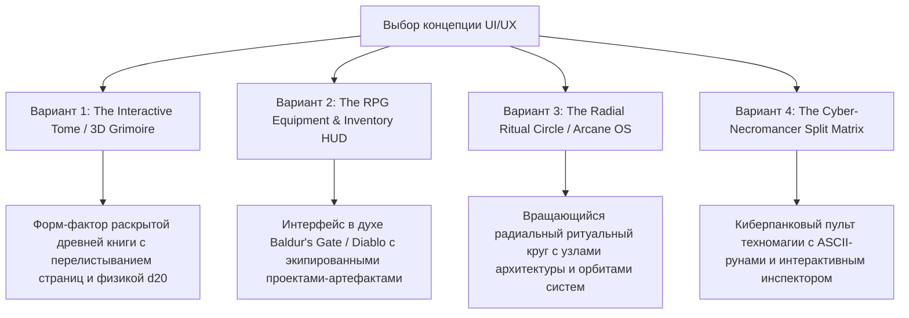

# План радикального UI/UX редизайна: "AsmODan — Beyond Standard Web"

## Цель планирования

Отказ от стандартных веб-паттернов (прямоугольные карточки, типовые бенто-блоки, обычные списки) в пользу **по-настоящему необычного, самобытного и запоминающегося интерфейса**, объединяющего:
1. **Персону AsmODan**: `Asm` (Ассемблер / Память) + `Dan` (Даниил) = `Azmodan` (Владыка архитектурного порядка).
2. **Эстетику D&D и Кибероккультизма**: магия школ, стат-блоки, инвентарь артефактов, ритуальные круги, броски дайсов.
3. **Безупречную функциональность для найма**: HR и тимлид мгновенно получают всю информацию без фрустрации.

---

## 🎨 4 Варианта Нестандартного UI/UX

---

### 📖 Вариант 1: "The Interactive Grimoire" (Раскрытый Техномагический Том)

Вместо обычной страницы весь сайт представляет собой **раскрытую книгу заклинаний (Cyber-Occult Tome)** в центре экрана на фоне мерцающего алтаря.

- **Левая страница тома (The Character Folio)**:
  - Кожано-пергаментный лист с неоновыми светящимися микросхемами-рунами.
  - Аватар Даниила, оформленный как портрет персонажа D&D.
  - D&D Stat Block (`STR 18`, `INT 20`, `WIS 19`, `CON 20`, `DEX 18`, `CHA 17`).
  - Быстрый свиток для HR (локация, формат, ТИФТ, кнопка с сургучной печатью *"Скачать резюме"*).
- **Правая страница тома (The Codex of Artifacts / Spellbook)**:
  - Закладки сверху/сбоку: `[Проекты-Реликвии]`, `[Ритуалы Архитектуры]`, `[Стек Навыков]`, `[Хроника]`.
  - При клике на закладки правая страница **тактильно и плавно перелистывается** с реалистичной анимацией листа.
  - При выборе проекта (`DrugsEngine`, `Tanks1984`) на странице разворачивается его схема, инварианты и руны кода.
- **Интерактивные фичи**:
  - На алтаре рядом с книгой лежит **интерактивный кубик d20**, который можно физически бросить мышкой или пробелом.
  - Встроенная кнопка вызова терминала открывает выдвижной ящик внизу алтаря.

---

### 🛡️ Вариант 2: "The RPG Equipment & Inventory HUD" (Инвентарь Артефактов)

Интерфейс, вдохновленный **экраном снаряжения персонажа в культовых RPG (Baldur's Gate 3 / Diablo / Cyberpunk 2077)**, адаптированный под инженерное портфолио.

- **Центр экрана (Equipment Screen)**:
  - В центре — стилизованный персонаж / аватар AsmODan со слотами экипировки:
    - 🗡️ **Правая рука**: `Клинок Чистой Архитектуры` (+5 к изоляции домена) ➔ клик открывает кейс-стади **DrugsEngine**.
    - 🛡️ **Левая рука**: `Гримуар CQRS & MediatR` (Разделение команд и запросов) ➔ клик открывает **FirstApi CQRS**.
    - 👁️ **Шлем / Око**: `Астральное Око Qdrant` (1536-мерное зрение эмбеддингов) ➔ клик открывает **Vector Search Microservice**.
    - 🦺 **Доспех**: `Панцирь Чистого Си` (Иммунитет к утечкам памяти и сборщику мусора) ➔ клик открывает **Tanks1984**.
    - 💍 **Кольцо 1**: `Кольцо Оптического Зрения` (Распознавание документов) ➔ клик открывает **Telegram OCR Bot**.
    - 📜 **Свиток на поясе**: `Свиток Знаний` ➔ мгновенное скачивание **resume.pdf**.
- **Нижняя панель (Action Bar / Hotbar)**:
  - Сферы Здоровья (Красная: *100% Test Coverage*) и Маны (Синяя: *Zero Memory Leaks*).
  - Горячие клавиши: `[1] Характеристики`, `[2] Архитектура`, `[3] Резюме`, `[~] Алтарь CLI`, `[Space] Бросок d20`.
- **Правая панель (Inspect Panel)**:
  - При клике на любой слот экипировки справа открывается детальный разбор: проблема, решение, метрики, архитектурный слой и ссылка на GitHub.

---

### ⭕ Вариант 3: "The Radial Ritual Circle" (Концентрический Радиальный Интерфейс)

Полный отказ от сеток и карточек. Вся навигация построена вокруг **вращающегося интерактивного ритуального круга**.

- **Центральное ядро (The Core)**:
  - Внутренний круг: **Inner Sanctum (Domain Model)** с рунами защиты.
- **Концентрические орбиты**:
  - 1-я орбита: **CQRS & Application Ring**.
  - 2-я орбита: **Infrastructure & Data Conduits**.
  - 3-я орбита: **Astral Qdrant Vector Space**.
- **Орбитальные узлы-системы**:
  - Вокруг круга по орбитам вращаются светящиеся рунические узлы проектов (`DrugsEngine`, `Tanks1984`, `Telegram OCR`).
  - При наведении орбита замедляется, а между узлами прорисовываются светящиеся связи потоков данных.
  - При клике на узел круг плавно смещается влево, а справа раскрывается **HUD Инспектора Системы**.
- **Кнопка "Fast HR Mode"**:
  - В правом верхнем углу всегда доступна кнопка `[📜 Экспресс-скрининг]`, которая разворачивает компактный модальный свиток с резюме за 0.1 секунды.

---

### 💻 Вариант 4: "Cyber-Necromancer Command Deck" (Киберпанк-Оккультный Пульт)

Футуристичный терминальный кокпит с кибероккультной графикой на Canvas:
- Разделенный экран: слева визуализатор ритуальных схем на векторном Canvas со светящимися рунами, справа — интерактивный структурированный терминал-инспектор.
- Полное управление как мышью, так и горячими клавишами (WASD, Enter, 1-4).

---

## ⚖️ Сравнительный анализ вариантов

| Параметр | Вариант 1 (Tome Grimoire) | Вариант 2 (RPG Inventory HUD) | Вариант 3 (Radial Circle) | Вариант 4 (Command Deck) |
|:---|:---:|:---:|:---:|:---:|
| **Вау-эффект & Уникальность** | ⭐⭐⭐⭐⭐ (Экстремальный) | ⭐⭐⭐⭐⭐ (Геймификация) | ⭐⭐⭐⭐ (Футуристичный) | ⭐⭐⭐⭐ (Киберпанк) |
| **Удобство для HR (Скрининг)** | ⭐⭐⭐⭐⭐ (Свиток на 1-й стр.) | ⭐⭐⭐⭐ (Кнопка свитка) | ⭐⭐⭐⭐⭐ (Модальный лист) | ⭐⭐⭐ (Сложнее) |
| **Удобство для Техлида** | ⭐⭐⭐⭐⭐ (Инспектор слоев) | ⭐⭐⭐⭐⭐ (Разбор артефактов) | ⭐⭐⭐⭐⭐ (Связи систем) | ⭐⭐⭐⭐⭐ (Код и терминал) |
| **Сложность верстки (CSS/JS)** | Средняя (CSS 3D / Tabs) | Средняя (Grid / HUD) | Высокая (Canvas / SVG) | Средняя (Flex / Split) |
| **Мобильная адаптивность** | ⭐⭐⭐⭐ (Вертикальный разворот) | ⭐⭐⭐⭐ (Слот-сетка) | ⭐⭐⭐ (Масштабирование) | ⭐⭐⭐⭐ (Колоночный стек) |

---

## 🛠️ Предлагаемые шаги реализации (после выбора концепции)

1. **Шаг 1: Утверждение визуальной концепции** (выбор между *Grimoire Tome*, *RPG Inventory*, *Radial Circle* или гибридом).
2. **Шаг 2: Проектирование разметки** в `index.html` (создание кастомного контейнера книги / HUD инвентаря / радиального круга).
3. **Шаг 3: Разработка кастомных стилей** в `styles.css` (пергаментные текстуры, эффекты свечения рун, анимация перелистывания / экипировки).
4. **Шаг 4: Интерактивная механика** в `main.js` (управление перелистыванием, броски d20, инспекция артефактов, звук перелистывания/дайсов по желанию).
5. **Шаг 5: Проверка адаптивности и печать резюме** (`@media print`).

---

## Open Questions для обсуждения

> [!IMPORTANT]
> 1. **Какой из 4 вариантов интерфейса резонирует сильнее всего?**
>    - **Вариант 1 (The Interactive Tome / Книга заклинаний)** — максимально атмосферно, листание страниц, пергамент + неоновые руны.
>    - **Вариант 2 (The RPG Inventory HUD / Экран снаряжения)** — сильный геймерский отклик (D&D / Diablo), кликабельные артефакты-проекты на персонаже.
>    - **Вариант 3 (The Radial Ritual Circle / Орбитальный круг)** — футуристично, геометрично, визуализирует связи систем.
> 2. **Аудио-сопровождение**: Стоит ли добавить опциональный переключатель звука (тихий щелчок броска d20, шелест страниц)?
> 3. **Мобильный UX**: В мобильной версии сохраняем адаптированный свиток / инвентарь или переключаем на упрощенный вертикальный вид?
